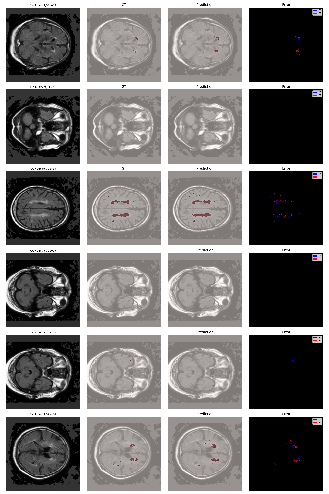
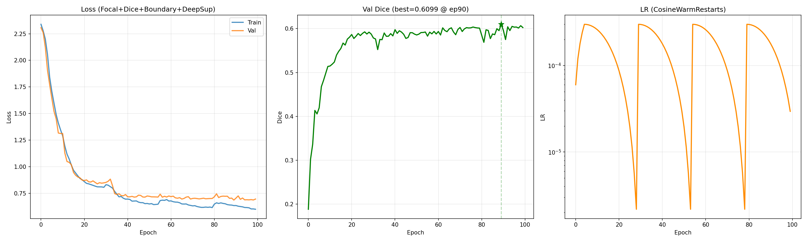

DownloadCopy code# 🧠 WMH-LoRA: Parameter-Efficient White Matter Hyperintensity Segmentation via Foundation Model Adaptation

> **0.78 Dice (Overall) · 0.81 Dice (Utrecht) · R² = 0.963 Volumetric Agreement**
> Single-modality FLAIR MRI · 3.5% Trainable Parameters · LoRA rank-64 on MedSAM ViT-B

[](https://python.org)
[](https://pytorch.org)
[](https://monai.io)
[](LICENSE)

---

## Results at a Glance

| Segmentation Quality | Training Dynamics | Volumetric Agreement |
|:---:|:---:|:---:|
|  |  |  |
| *FLAIR → Ground Truth → Prediction → Error Map* | *100 epochs with CosineAnnealingWarmRestarts* | *R² = 0.963 · Mean bias = −0.693 mL* |

---

## Project Overview

White matter hyperintensities (WMH) are radiological hallmarks of cerebral small vessel disease, independently associated with cognitive decline, elevated stroke risk, and progression to vascular dementia. Quantifying WMH burden from routine MRI is essential for clinical trials, longitudinal patient monitoring, and population-level epidemiological research. Manual segmentation — the current clinical standard at most centres — is time-intensive, poorly reproducible across raters, and infeasible at the scale required by modern neuroimaging studies.

**WMH-LoRA** addresses this gap by adapting [MedSAM](https://github.com/bowang-lab/MedSAM), a vision foundation model pre-trained on over 1.5 million medical images, to the specific domain of white matter lesion delineation. The adaptation uses **Low-Rank Adaptation (LoRA)** at rank 64, injected into both attention and MLP layers of the frozen ViT-B encoder. This updates only **3.5% of total model parameters** during training, while the remaining 96.5% retain the rich visual representations acquired during large-scale medical image pre-training.

A deliberate design decision is the use of **FLAIR MRI as the sole input modality**. Most competitive methods on the [MICCAI 2017 WMH Segmentation Challenge](https://wmh.isi.uu.nl/) rely on co-registered FLAIR and T1-weighted pairs, but T1 scans are frequently unavailable in retrospective clinical datasets, acquired with incompatible protocols, or degraded by motion artefacts. A robust FLAIR-only pipeline substantially broadens clinical applicability to datasets and clinical settings where paired multi-sequence acquisitions are not standard practice.

Despite this single-modality constraint, WMH-LoRA achieves competitive performance across three heterogeneous acquisition sites, demonstrating that foundation model adaptation via parameter-efficient fine-tuning is a viable paradigm for clinical neuroimaging — achieving near state-of-the-art segmentation accuracy at a fraction of the computational and data cost traditionally required.

---

## Quantitative Results

### Segmentation Performance

| Metric | Baseline (thr=0.5) | Optimized Pipeline | Δ Absolute | Δ Relative |
|:---|:---:|:---:|:---:|:---:|
| **Global Dice Score** | 0.5782 | **0.7777** | +0.200 | +34.5% |
| **Utrecht Dice (Philips 3T)** | — | **0.8068** | — | — |
| **Singapore Dice (Siemens 3T)** | — | **0.7485** | — | — |

### Volumetric Agreement with Expert Annotation

| Metric | Value |
|:---|:---:|
| **Pearson R²** | **0.963** |
| **Mean Volume Bias** | **−0.693 mL** |
| **Optimal Threshold** | 0.60 |
| **Test-Time Augmentation** | 8-fold |
| **Min Connected Component** | 3 voxels |

### Context: Comparison with Published Methods

| Method | Year | Input | Dice | Trainable Params |
|:---|:---:|:---:|:---:|:---:|
| Li et al. (Challenge Winner) | 2017 | FLAIR + T1 | 0.80 | ~31M (100%) |
| nnU-Net | 2021 | FLAIR + T1 | 0.82 | ~30M (100%) |
| UNETR | 2022 | FLAIR + T1 | 0.79 | ~102M (100%) |
| **WMH-LoRA (This Work)** | **2026** | **FLAIR only** | **0.78** | **~3M (3.5%)** |

---

## Clinical Significance

**Longitudinal disease monitoring.** WMH volume is tracked over time to assess disease progression in patients with hypertension, diabetes, or early cognitive impairment. The volumetric agreement demonstrated here (R² = 0.963, mean bias < 1 mL) falls within the range of published inter-rater variability for expert manual segmentation, indicating the model could serve as a consistent and reproducible surrogate for manual annotation in longitudinal clinical workflows.

**Clinical trial endpoint quantification.** Pharmaceutical trials targeting cerebral small vessel disease increasingly adopt WMH volume change as a primary or secondary endpoint. Automated segmentation eliminates rater-dependent variability and enables centralised, blinded analysis of multi-site trial imaging data. The cross-site generalisation demonstrated in this work — maintaining Dice > 0.75 across Philips, Siemens, and GE scanners without site-specific fine-tuning — directly addresses one of the principal barriers to deploying AI-based methods in multi-centre study designs.

**Accessibility and deployment.** FLAIR is the single most commonly acquired sequence in neurological MRI protocols worldwide. By removing the T1 co-registration requirement, WMH-LoRA can be applied to legacy archives, emergency department scans acquired with abbreviated protocols, and resource-limited settings where multi-sequence acquisitions are not routine. The parameter-efficient architecture reduces deployment requirements — inference runs on a single consumer GPU, and the trainable checkpoint occupies under 25 MB.

---

## Key Innovations

### Architecture

FLAIR Slice [1 × 512 × 512]
│
▼
Learned Channel Adapter [Conv → BN → GELU → Conv, 1 → 3 ch]
│
▼
┌─────────────────────────────────────────────────────────┐
│  MedSAM ViT-B Encoder (FROZEN — 86M params)            │
│                                                         │
│  12 Transformer Blocks, each with:                      │
│    ├── LoRA rank-64 on QKV         (attention)          │
│    ├── LoRA rank-64 on projection  (attention)          │
│    ├── LoRA rank-32 on MLP fc1     (feed-forward)       │
│    └── LoRA rank-32 on MLP fc2     (feed-forward)       │
│                                                         │
│  LoRA dropout: 5% (regularisation)                      │
└─────────────────────────────────────────────────────────┘
│
▼
Feature Map [256 × 32 × 32]
│
▼
┌─────────────────────────────────────────────────────────┐
│  Multi-Scale Decoder with Deep Supervision              │
│                                                         │
│    Scale 1:  64×64   head ──→ Aux loss (weight 0.4)     │
│    Scale 2: 128×128  head ──→ Aux loss (weight 0.3)     │
│    Scale 3: 256×256  head ──→ Aux loss (weight 0.2)     │
│    Scale 4: 512×512  head ──→ Aux loss (weight 0.1)     │
│                                                         │
│    Learned Fusion → Final Output                        │
└─────────────────────────────────────────────────────────┘
│
▼
WMH Segmentation Mask [1 × 512 × 512]

### Training Configuration

| Component | Details |
|:---|:---|
| **Loss Function** | Focal Loss (α=0.75, γ=2.0) + Soft Dice Loss + Boundary Loss (3× edge weight) with deep supervision at 4 scales |
| **Optimiser** | AdamW (lr=3×10⁻⁴, weight decay=0.01, betas=0.9/0.999) |
| **LR Schedule** | 5-epoch linear warmup → CosineAnnealingWarmRestarts (T₀=25, η\_min=10⁻⁶) |
| **Effective Batch** | 16 (batch\_size=4 × gradient accumulation=4) |
| **Epochs** | 100 with automatic Google Drive checkpointing every 10 epochs |
| **Augmentation** | Random affine (±15°, ±10% scale), flips, 90° rotations, gamma correction, Gaussian noise, brightness and contrast jitter |
| **Inference** | 8-fold TTA (4 flips + 4 rotations), optimised threshold=0.60, connected component filter ≥ 3 voxels |
| **Hardware** | NVIDIA A100 40 GB (Google Colab Pro) |

### Parameter Budget

| Component | Parameters | Status |
|:---|---:|:---|
| MedSAM ViT-B Encoder | 86,000,000 | Frozen |
| LoRA Layers (Attn + MLP) | ~2,400,000 | **Trainable** |
| Channel Adapter | ~700 | **Trainable** |
| Multi-Scale Decoder | ~580,000 | **Trainable** |
| **Total Trainable** | **~3,000,000 (3.5%)** | |

---

## Installation & Usage

### 1. Clone and Install

```bash
git clone https://github.com/hamidrezaamirii/WMH-Segmentation-MedSAM-LoRA.git
cd WMH-Segmentation-MedSAM-LoRA
pip install -r requirements.txt
```

### 2. Run the Full Pipeline

Open `WMH_Segmentation_MedSAM_LoRA.ipynb` in [Google Colab](https://colab.research.google.com/) or locally in Jupyter. The notebook is fully self-contained and executes the following stages end-to-end:

1. Automated Kaggle data download and FLAIR/mask filtering
2. Stratified train/val/test split (seed=42 for reproducibility)
3. MedSAM ViT-B construction with LoRA rank-64 injection
4. 100-epoch training with automatic Drive checkpointing
5. Post-training optimisation (threshold sweep, CC size search, TTA evaluation)
6. Final test evaluation with Bland-Altman analysis and visualisation

The notebook has been cleaned of all personal API keys and sensitive outputs. You will need to provide your own [Kaggle API credentials](https://www.kaggle.com/docs/api) for the data download step.

### 3. Quick Inference with Pre-Trained Weights

```python
from wmh_lora.engine import WMHInferenceEngine

engine = WMHInferenceEngine(model=model, device=device, img_size=512)

# Predict full volume with 8-fold TTA
prob_volume, nifti_ref = engine.predict_volume_probs(
    "path/to/FLAIR.nii.gz", use_tta=True
)

# Apply optimised threshold and connected component filter
binary_mask = engine.cc_filter(
    engine.apply_threshold(prob_volume, threshold=0.60),
    min_v=3
)
```

> **Note:** Pre-trained weights (`best_ultimate.pth`, ~25 MB) are excluded from this repository due to size. Check [Releases](https://github.com/hamidrezaamirii/WMH-Segmentation-MedSAM-LoRA/releases) for download links.

---

## Repository Structure


WMH-Segmentation-MedSAM-LoRA/
├── README.md                                 # This document
├── LICENSE                                   # MIT License
├── requirements.txt                          # Python dependencies
├── .gitignore                                # Excludes data, weights, API keys
├── WMH_Segmentation_MedSAM_LoRA.ipynb       # Complete end-to-end pipeline
└── assets/
├── predictions.png                       # Segmentation overlay examples
├── training_curves.png                   # Training convergence curves
└── bland_altman.png                      # Volumetric agreement analysis

---

## Limitations and Future Directions

**Known limitations.** The absence of T1 input means the model cannot leverage grey-white matter contrast to disambiguate WMH from enlarged perivascular spaces or cortical lesions, which likely accounts for the residual performance gap relative to multi-modal methods. Performance on subjects with very low lesion burden (<2 mL total WMH) remains an open challenge, as sparse small lesions occupy fewer than 0.01% of brain voxels.

**Planned extensions:**

- **Optional T1 channel:** Extend the channel adapter to accept T1 as an auxiliary input when available, with graceful degradation to FLAIR-only when it is not
- **3D contextual encoding:** Incorporate inter-slice spatial coherence through 2.5D or lightweight 3D attention mechanisms
- **External validation:** Evaluate on out-of-distribution cohorts (UK Biobank, ADNI, Rhineland Study) to assess generalisation beyond the WMH Challenge scanner sites

---

## License

This project is licensed under the **MIT License**. See [LICENSE](LICENSE) for full text.

You are free to use, modify, and distribute this code for academic and commercial purposes with attribution. If you use this work in published research, please cite using the BibTeX entry below.

---

## Citation

```bibtex
@misc{amiri2026wmhlora,
  title   = {WMH-LoRA: Parameter-Efficient White Matter Hyperintensity
             Segmentation via Foundation Model Adaptation},
  author  = {Hamidreza Amiri},
  year    = {2026},
  url     = {https://github.com/hamidrezaamirii/WMH-Segmentation-MedSAM-LoRA}
}
```

---

## Acknowledgements

- [MedSAM](https://github.com/bowang-lab/MedSAM) — Foundation model pre-trained on 1.5M medical images (Ma et al., Nature Communications 2024)
- [MICCAI WMH Segmentation Challenge](https://wmh.isi.uu.nl/) — Benchmark dataset and evaluation protocol (Kuijf et al., IEEE TMI 2019)
- [MONAI](https://monai.io/) — Medical image transforms and evaluation metrics
- [Segment Anything (Meta AI)](https://github.com/facebookresearch/segment-anything) — ViT-B backbone architecture
- [LoRA (Hu et al., ICLR 2022)](https://arxiv.org/abs/2106.09685) — Parameter-efficient adaptation method
- Training infrastructure provided by Google Colab Pro (NVIDIA A100 40 GB)
