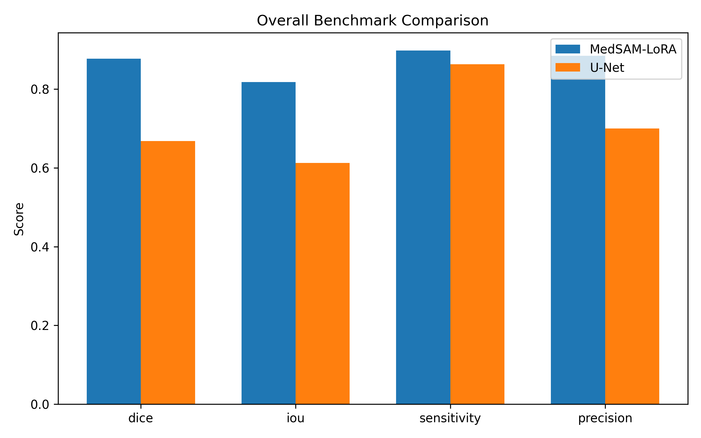
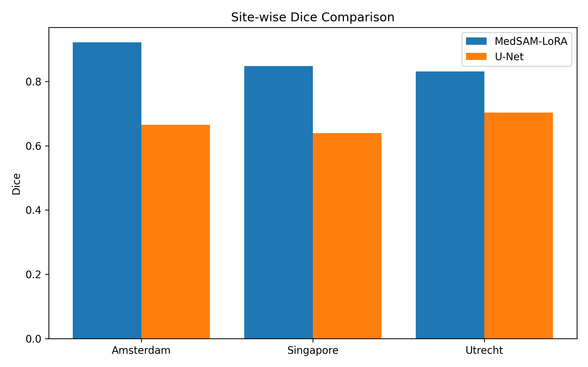
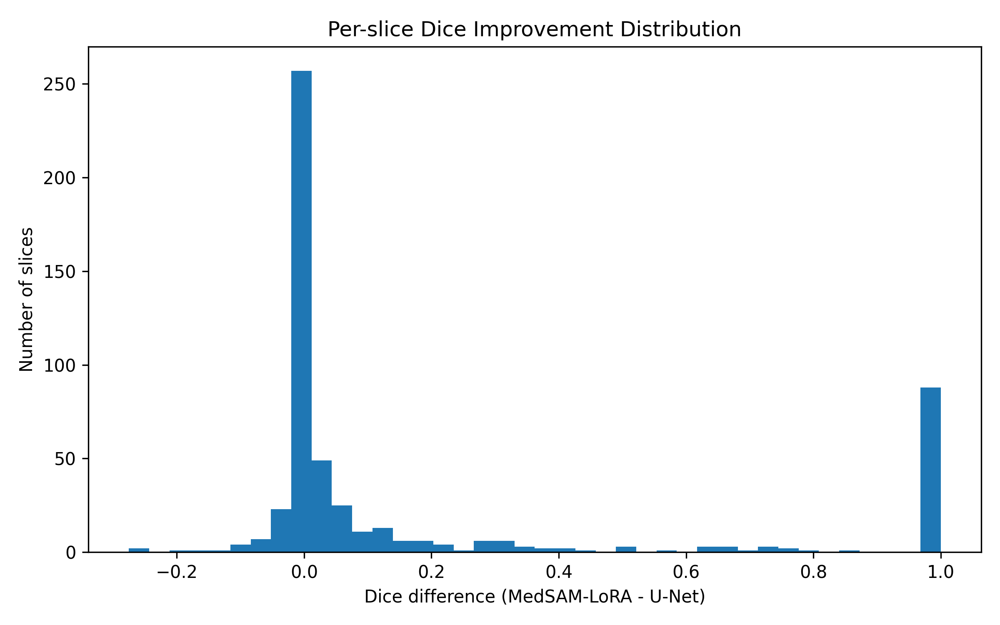

# WMH MedSAM-LoRA

Parameter-efficient adaptation of the MedSAM foundation model for white matter hyperintensity (WMH) segmentation using custom LoRA.

This repository provides a reproducible implementation, benchmark evaluation, and statistical comparison against a U-Net baseline.

---

# Overview

This project investigates whether a lightweight LoRA adaptation of MedSAM ViT-B can improve WMH segmentation performance while updating only a small fraction of model parameters.

The final model uses a custom LoRA implementation applied to MedSAM components without full model fine-tuning.

---

# Method

## Backbone

- Model: MedSAM ViT-B
- Adaptation: Custom LoRA
- LoRA rank: 4
- LoRA layers: 80

Trainable parameters:

```
673,792
```

Total parameters:

```
94,409,264
```

Only LoRA parameters are optimized during training.

---

# Dataset

The project uses the WMH dataset with patient-level separation.

## Dataset split

| Split | Patients | Slices |
|---|---:|---:|
| Training | 42 | 2506 |
| Validation | 9 | 537 |
| Test | 9 | 537 |

The benchmark evaluation uses the complete 537-slice test cohort:

- Positive slices: 232
- Empty slices: 305

No slices were removed during evaluation.

Sites:

- Singapore
- Amsterdam
- Utrecht

---

# Training Configuration

Training configuration:

- Optimizer: AdamW
- Epochs: 20
- Batch size: 2
- Best checkpoint selected using validation Dice

Best checkpoint:

```
Epoch: 9
Validation Dice: 0.8892
```

---

# Benchmark Protocol

The final MedSAM-LoRA checkpoint was compared against a previously trained U-Net baseline.

Important:

- No retraining was performed during benchmarking.
- Both models were evaluated on the identical 537 test slices.
- The same ground-truth masks and scoring protocol were used.
- Slice-level paired comparison was performed.

---

# Benchmark Results

## Overall Performance

| Model | Dice | IoU | Sensitivity | Precision |
|---|---:|---:|---:|---:|
| MedSAM-LoRA | 0.8777 | 0.8177 | 0.8985 | 0.8849 |
| U-Net | 0.6683 | 0.6125 | 0.8636 | 0.6999 |

MedSAM-LoRA improved Dice by:

```
+0.2094
```

---

# Statistical Analysis

Paired Wilcoxon signed-rank testing was performed on all 537 slices.

Results:

| Metric | p-value |
|---|---:|
| Dice | 3.05e-36 |
| IoU | 1.08e-36 |
| Precision | 2.83e-27 |
| Sensitivity | 0.029 |

Statistically significant differences were observed for Dice, IoU, Precision, and Sensitivity under paired Wilcoxon signed-rank testing.

---

# Site-wise Generalization

MedSAM-LoRA consistently outperformed U-Net across all acquisition sites.

| Site | MedSAM Dice | U-Net Dice |
|---|---:|---:|
| Amsterdam | 0.9220 | 0.6650 |
| Singapore | 0.8477 | 0.6390 |
| Utrecht | 0.8311 | 0.7033 |

Site-wise statistical analysis is provided in:

```
results/benchmark/statistical_analysis_by_site.md
```

---

# Figures

## Overall comparison



## Site-wise Dice comparison



## Per-slice Dice improvement



---

# Reproducibility

The repository includes:

- complete configuration files
- environment specification
- dataset split verification
- checkpoint metadata
- benchmark scripts
- statistical analysis scripts

Important files:

```
configs/
results/
figures/
src/
environment.yml
requirements.txt
CITATION.cff
```

---

# Limitations

The current protocol evaluates box-prompted WMH segmentation using ground-truth-derived prompts.

This repository does not claim fully automatic segmentation.

---

# Repository Structure

```
WMH-MedSAM-LoRA/

├── configs/
├── checkpoints/
├── results/
├── figures/
├── src/
├── notebooks/
├── README.md
├── CITATION.cff
└── environment.yml
```

---

# Citation

If you use this repository, please cite:

See:

```
CITATION.cff
```

---

# Future Work

Future directions include:

- automatic prompt generation
- additional external validation
- larger external multi-center validation
- ablation studies of LoRA placement